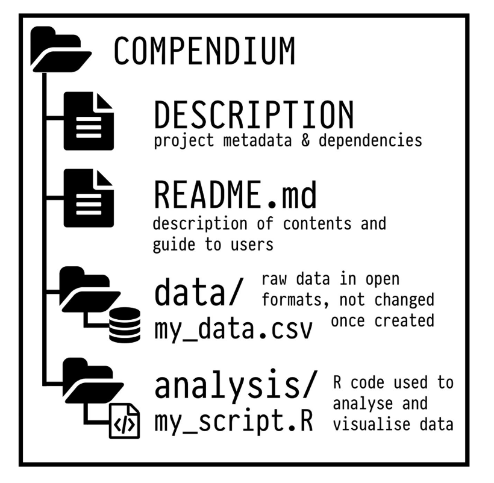
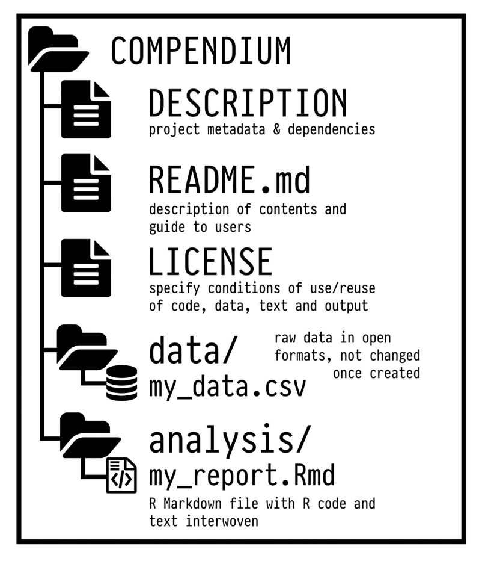
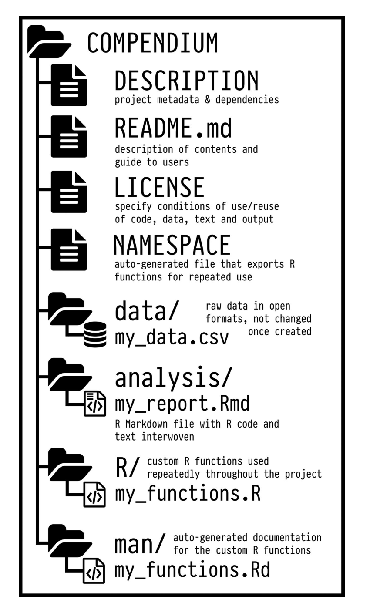

```{r setup, include=FALSE, echo=FALSE}
options(htmltools.dir.version = FALSE)
knitr::opts_chunk$set(comment = "")
```


# Virtuous research cycle

<center>


</center>


---

# Workflow

* Use tidy data format with `tidyverse`

* Prefer .csv, and do not modify original files

* Write functions instead of repeating yourself (not covered)

* Version control with `Git` and `GitHub` (easy in `RStudio`)

* Literate programming with `RMarkdown`

* Organise and share your stuff in research compendia (not covered)

---

# Research compendium (1/3)

* a single file of `R` code with in-line comments documenting the  workflow

* a `R Markdown` file with text and code in the same source document, and accompanyingdata files

* stick with the conventions of your peers

---

# Research compendium (2/3)

* as project grows, more structure is needed

<center>



</center>

---

# Research compendium (2/3)

* as project grows, more structure is needed

<center>



</center>


---

# Research compendium (2/3)

* as project grows, more structure is needed

<center>



</center>


---

# Research compendium (3/3)

* Read Marwick, Boettiger & Mullen (2018). [Packaging Data Analytical Work Reproducibly Using R (and Friends)](https://peerj.com/preprints/3192/). The American Statistician 72: 80-88.

* Use package [`rrtools`](https://github.com/benmarwick/rrtools) developed by Ben Marwick or  [`rcompendium`](https://frbcesab.github.io/rcompendium/) developed by Nicolas Casajus at CESAB.

* Further reading: https://research-compendium.science/ 

---

# Further reproducility

* Use a [Make file](https://kbroman.org/minimal_make/) to automate the execution of a series of commands

* Build your own package (pointers [here](https://support.rstudio.com/hc/en-us/articles/200486488-Developing-Packages-with-RStudio))

* Use pipeline toolkits with `targets` (see [here](https://ropensci.org/blog/2021/02/03/targets/) and [there](https://books.ropensci.org/targets/))

* Build an image of your working environment with  [Docker](https://environments.rstudio.com/docker) 


---

# Closing remarks

* You do not need to adopt all these practices at once

* Reproducibility is a gradient, pick the level that works for you

* Already great to set your mind in that direction


---

# Acknowledgments

* The workshop website was built with [Distill for R Markdown](https://rstudio.github.io/distill/website.html)

* I used [xaringan::moon_reader](https://slides.yihui.org/xaringan/#1) for the slides

* I re-used some material from [Ulrik Lyngs](https://ulriklyngs.com/), [Garrett Grolemund](https://rstudio.com/speakers/garrett-grolemund/), [Anna Krystalli](https://annakrystalli.me/), [Julien Barnier](https://juba.github.io/tidyverse/) and [Cécile Sauder](https://github.com/cecilesauder/RLadiesTidyverse)

* R-related illustrations are from [Allison Horst](https://github.com/allisonhorst/stats-illustrations)

* Kuddos to my colleagues N. Casajus, F. Guilhaumon, N. Schiettekatte, S. Dray, L. Guéry of the [CESAB / GDR EcoStat workshop on reproducible science](https://frbcesab.github.io/datatoolbox/) from which I learnt so much

